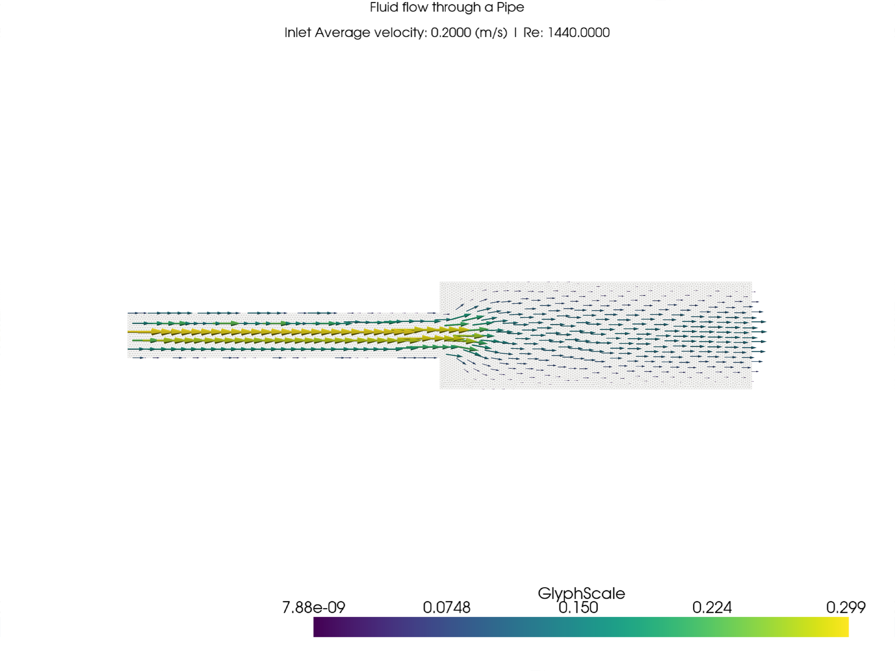

# ns-pipe-expansion

This repo models the veloicty of water through a pipe of a sudden expansion, of inlet diameter of 7.2 mm, and an outlet diameter of 17.2mm. It impliments the 2D incompressible Navier Stokes equation and is written in FEniCSx with a Gmsh-generated mesh.

A time-dependent solver is implemented, using the IPCS (Incremental Pressure Correction Scheme splitting) method on Taylor–Hood elements. The final velocity field is rendered with PyVista.


## Project Structure 
```
ns-pipe-expansion/
├── src/
│   ├── params.py                   
│   ├── mesh/mesh.py
│   └── solvers/2_time_dependent_solver.py    
├── output/time_dependent_solver.png  
├── .devcontainer/                  
└── requirements.txt
```

## Methodology and Formulation

### Governing equations

Momentum and continuity, with $u$ velocity, $p$ pressure, $\rho$ density, $\mu$ dynamic viscosity, $f$ body force per unit volume:

$$\rho\left(\frac{\partial u}{\partial t} + u \cdot \nabla u\right) = \nabla \cdot \sigma(u, p) + f,
\qquad \nabla \cdot u = 0$$

$$\sigma(u, p) = 2\mu\,\varepsilon(u) - pI, \qquad \varepsilon(u) = \tfrac{1}{2}\left(\nabla u + (\nabla u)^T\right)$$

### Weak form

With the inner product defined on the domain and the boundary condition defined as; $\langle v, w \rangle := \int_\Omega v \cdot w \, \mathrm{d}x$ and $\langle v, w \rangle_{\partial\Omega} := \int_{\partial\Omega} v \cdot w \, \mathrm{d}s$, find $(u, p)$ such that for all test functions $(v, q)$, gives:

$$\rho\left\langle \frac{\partial u}{\partial t}, v \right\rangle + \rho\,\langle (u \cdot \nabla)\, u, v \rangle + \langle \sigma(u, p), \varepsilon(v) \rangle - \langle T, v \rangle_{\partial\Omega} = \langle f, v \rangle,
\qquad \langle \nabla \cdot u, q \rangle = 0$$

Inlet and walls are taken as Dirichlet, so $v = 0$, reducing to the traction term $T = \sigma \cdot n$
drops out. Outlet is not imposed, allowing for natural outflow condition.

### IPCS splitting

A monolithic solve of the coupled system is expensive, so each timestep is split into three
linear sub-problems. Here $u^{*}$ is the tentative velocity, $u^n$ / $u^{n-1}$ the two previous
velocities, $p^n$ the current pressure and $\phi$ the pressure increment ($f = (0,0)$ throughout):

**1. Tentative velocity** — solve for $u^{*}$:

$$\frac{\rho}{\Delta t}\langle u - u^n, v \rangle + \langle (u_{\text{AB}} \cdot \nabla)\, u^{n+\frac{1}{2}}_{\text{CN}}, v \rangle + \mu\,\langle \nabla u^{n+\frac{1}{2}}_{\text{CN}}, \nabla v \rangle - \langle p^n, \nabla \cdot v \rangle + \langle f, v \rangle = 0$$

**2. Pressure correction** — Poisson problem for $\phi$, then $p^{n+1} = p^n + \phi$:

$$\langle \nabla\phi, \nabla q \rangle = -\frac{\rho}{\Delta t}\langle \nabla \cdot u^{*}, q \rangle$$

**3. Velocity correction** — project $u^{*}$ onto the divergence-free space:

$$\rho\,\langle u, v \rangle = \rho\,\langle u^{*}, v \rangle - \Delta t\,\langle \nabla\phi, v \rangle$$

Time integration is Crank–Nicolson on the transported and viscous terms, with the convective
velocity extrapolated by Adams–Bashforth to keep step 1 linear:

$$u^{n+\frac{1}{2}}_{\text{CN}} := \tfrac{1}{2}(u + u^n), \qquad u_{\text{AB}} := \tfrac{3}{2}u^n - \tfrac{1}{2}u^{n-1}$$

Spaces are Taylor–Hood: vector P2 velocity, scalar P1 pressure, ensuring inf-sup stability. Each sub-problem gets its own PETSc `KSP` solver.

### Geometry, mesh and boundary conditions

The domain is two joint rectangles (inlet $d_1$, outlet $d_2$, each half of a 100 mm run). Physical groups tag inlet (1), outlet (2), walls (3) and the domain (10) are applied. Boundary conditions are no-slip on the walls, $p = 0$ at the outlet, and a parabolic (Poiseuille) inlet profile:

$$u(y) = \frac{4\,U_{\max}\,(y - y_{\mathrm{bot}})(y_{\mathrm{top}} - y)}{d_1^2},
\qquad \bar{U} = \tfrac{2}{3}\,U_{\max}, \qquad Re = \frac{\rho\,\bar{U}\,d_1}{\mu}$$

$U_{\max}$ is set from a target mean inlet velocity via $U_{\max} = \tfrac{3}{2}\bar{U}$, and the
Reynolds number uses the inlet diameter $d_1$ as characteristic length. Fluid properties typical water($\rho = 1000$ kg/m³, $\mu = 10^{-3}$ Pa·s) and $Re$ is kept laminar. All run parameters
live in [params.py](src/params.py).

## Running it

To run the solver yourself, clone the repo and open it in the devcontainer (VSCode: "Reopen in Container"). The container has all dependencies (dolfinx, PETSc, Gmsh) within. Once the container is running, execute the solver to get the output plots in the `output/` directory. It will be named `output/time_dependent_solver.png`. The next section shows a example of the output plot.

## Output




## Limitations


This is a single working simulation, not a validated study. It solves the time-dependent Navier–Stokes equations and reports only the velocity field at the final timestep (though it can be modified to output the full time evolution). Since the target is the final steady flow, the steady-state Navier–Stokes equations would have been sufficient on their own.


## References

1. Dokken, J.S. — [FEniCSx tutorial: Navier–Stokes](https://jsdokken.com/dolfinx-tutorial/chapter2/navierstokes.html),
   [channel flow](https://jsdokken.com/dolfinx-tutorial/chapter2/ns_code1.html),
   [flow past a cylinder](https://jsdokken.com/dolfinx-tutorial/chapter2/ns_code2.html),
   [Gmsh](https://jsdokken.com/src/tutorial_gmsh.html)
2. Larson, M.G., Bengzon, F. — *The Finite Element Method: Theory, Implementation, and
   Applications*. Texts in Computational Science and Engineering, vol. 10. Springer (2013)
