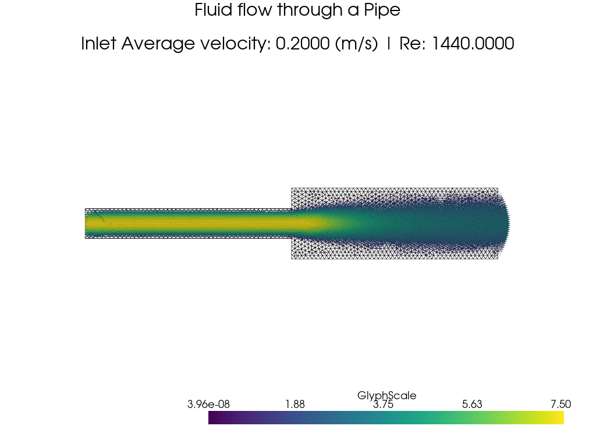

# Time-Dependent Navier-Stokes (IPCS)

## 1. Problem

Solving incompressible Navier-Stokes through an expansion pipe from $d_1 = 7.2\,\text{mm}$ to $d_2 = 17.2\,\text{mm}$.

**Goal**: back-calculate the loss coefficient $K$ and compare to experimental data.

## 2. Governing Equations

**Navier-Stokes (Momentum Equation):**

$$\rho\left(\frac{\partial u}{\partial t} + u \cdot \nabla u\right) = \nabla \cdot \sigma(u, p) + f$$

where $u$ = velocity, $p$ = pressure, $\rho$ = density, $f$ = force per unit volume.

**Stress Tensor:**

$$\sigma(u, p) = 2\mu\,\varepsilon(u) - pI$$

where $\mu$ is the dynamic viscosity and $\varepsilon(u) = \tfrac{1}{2}\left(\nabla u + (\nabla u)^T\right)$ is the strain rate tensor.

**Continuity Equation (Conservation of Mass):**

$$\frac{\partial \rho}{\partial t} + \nabla \cdot (\rho u) = 0$$

Since $\rho$ is constant, the time derivative vanishes and this reduces to the incompressibility condition:

$$\nabla \cdot u = 0$$

## 3. Weak Formulation

Inner product notation over the domain $\Omega$ and its boundary $\partial\Omega$ is defined as:

$$\langle v, w \rangle := \int_\Omega v \cdot w \, \mathrm{d}x, \qquad \langle v, w \rangle_{\partial\Omega} := \int_{\partial\Omega} v \cdot w \, \mathrm{d}s$$

Integrating the stress divergence term by parts gives the boundary term:

$$\langle -\nabla \cdot \sigma, v \rangle = \langle \sigma, \varepsilon(v) \rangle - \langle T, v \rangle_{\partial\Omega}$$

The boundary term $\langle T, v \rangle_{\partial\Omega}$ vanishes at the inlet and walls; at the outlet it gives the do-nothing (natural outflow) condition.

## 4. IPCS Scheme

A monolithic solve is expensive, so a splitting (projection) method is used instead, reducing the problem to three cheaper sub-problems per timestep. A deeper understanding of IPCS vs. monolithic approaches isn't well established yet.

**Step 1 — Tentative velocity** (weak momentum, explicit old pressure, viscous term integrated by parts):

$$\frac{\rho}{\Delta t}\langle u^{*} - u^n, v \rangle + \langle (u^{n+\frac{1}{2}}_{\text{AB}} \cdot \nabla)\, u^{n+\frac{1}{2}}_{\text{CN}}, v \rangle + \mu\langle \nabla u^{n+\frac{1}{2}}_{\text{CN}}, \nabla v \rangle - \langle p^n, \nabla \cdot v \rangle = \langle f, v \rangle$$

where $u^{n+1/2}_{\text{CN}} = \frac{1}{2}(u^{*} + u^n)$ and $u^{n+1/2}_{\text{AB}} = \frac{3}{2}u^n - \frac{1}{2}u^{n-1}$.

**Step 2 — Pressure correction** (Poisson equation for the pressure update $\phi$):

$$\langle \nabla\phi, \nabla q \rangle = -\frac{\rho}{\Delta t}\langle \nabla \cdot u^{*}, q \rangle$$

The pressure is then updated as $p^{n+1} = p^n + \phi$.

**Step 3 — Velocity correction**:

$$\rho\,\langle u^{n+1}, v \rangle = \rho\,\langle u^{*}, v \rangle - \Delta t\,\langle \nabla\phi, v \rangle$$

**Crank-Nicolson / Adams-Bashforth**

Crank-Nicolson is used on the viscous term, with an Adams-Bashforth extrapolation for the nonlinear convective term. This converges better than implicit Euler for the given mesh, at the cost of being less stable, which makes it easier to isolate where an error originates. Deeper details of the Adams-Bashforth scheme are still being worked through.

**Taylor-Hood elements**

The velocity space uses degree-2 Lagrange (vector) elements. The classical Taylor-Hood pairing uses degree-1 Lagrange for pressure (P2/P1); the current implementation (see §5) instead uses degree-2 Lagrange for pressure as well. Still working through the implications of this (inf-sup condition, element pairing).

## 5. Implementation

The implementation follows the FEniCSx tutorials [1, 2] closely, split across `src/mesh/mesh.py`, `src/params.py`, and `src/solvers/2_time_dependant_sovler.py`.

1. **Mesh** (`src/mesh/mesh.py`): the 2D geometry is built in Gmsh [4] from two rectangles (inlet section of diameter $d_1$, outlet section of diameter $d_2$) joined with `fragment`. Physical groups tag the inlet, outlet, and wall facets (tags 1, 2, 3) and the full domain (tag 10), so the mesh size, pipe length, and diameters can be changed via `Parameters` without touching the mesh logic.
2. **Function spaces and boundary conditions**: a vector P2 space for velocity and a scalar P2 space for pressure are created, along with the facet dimension for `locate_dofs_topological`. Boundary conditions are: no-slip on the walls, a parabolic (Poiseuille) inlet velocity profile, and zero pressure at the outlet.
3. **Variational forms and PETSc solvers**: each of the three IPCS steps is assembled as a UFL form and solved with a dedicated PETSc `KSP` solver — BiCGStab/Jacobi for the tentative velocity step, MINRES with Hypre BoomerAMG for the pressure Poisson step, and CG/SOR for the velocity correction step.
4. **Time loop**: steps through `num_steps = T / dt` iterations, reassembling and solving the three systems each step, and shifting $u^{n-1} \leftarrow u^n \leftarrow u^{n+1}$ for the Adams-Bashforth extrapolation.
5. **Visualisation**: PyVista renders the final velocity field as glyphs over a wireframe of the mesh, annotated with the average inlet velocity and Reynolds number, and saves it to `output/time_dependant_solver.png`.

Inlet uses a parabolic (Poiseuille) profile, zero at the walls and maximum at the centreline:

$$u(y) = \frac{4\,U_{\max}\,(y - y_{\mathrm{bot}})(y_{\mathrm{top}} - y)}{d_1^2}$$

Average inlet velocity (analytically, for this profile):

$$\bar{U} = \frac{2}{3}\,U_{\max}$$

Reynolds number based on the inlet diameter $d_1$:

$$Re = \frac{\rho\,\bar{U}\,d_1}{\mu}$$

Physical parameters are set to water, with the Reynolds number kept low to avoid turbulence. An average inlet velocity matching the experimental data is the target, with $U_{\max}$ tuned so the analytical average matches it, which then makes the back-calculation of $K$ more direct. A dashboard reporting the average inlet/outlet velocity and Reynolds number is still planned (see [TODO](../TODO.md)).

## 6. Result

Current PyVista output of the velocity field through the expansion:

## 7. Validation

Experimental data for a 7.7 mm to 17.2 mm sudden expansion was collected, but the corresponding Reynolds numbers are too high for a laminar simulation to be directly comparable. Instead, arbitrary laminar flow rates ($Re < 2000$) are used as inputs, and the loss coefficient $K$ is back-calculated from the simulated pressure drop. This is then compared against the analytical Borda-Carnot value for a sudden expansion:

$$K = \left(1 - \frac{A_1}{A_2}\right)^2$$

## 8. What I still need to understand

- Inf-sup condition, and what pressure element degree it actually requires here
- Monolithic approach vs. splitting (IPCS)
- Long Chen notes (see references [5, 6])

## 9. References

1. Dokken, J. S. — *FEniCSx Tutorial: Navier-Stokes equations.* <https://jsdokken.com/dolfinx-tutorial/chapter2/navierstokes.html>
2. Dokken, J. S. — *Test problem 1: Channel flow.* <https://jsdokken.com/dolfinx-tutorial/chapter2/ns_code1.html>
3. Dokken, J. S. — *Test problem 2: Flow past a cylinder.* <https://jsdokken.com/dolfinx-tutorial/chapter2/ns_code2.html>
4. Dokken, J. S. — *GMSH tutorial.* <https://jsdokken.com/src/tutorial_gmsh.html>
5. Chen, L. — *Finite Element Methods for Stokes Equations.* (to read)
6. Chen, L. — *Inf-Sup Conditions for Operator Equations.* (to read)
